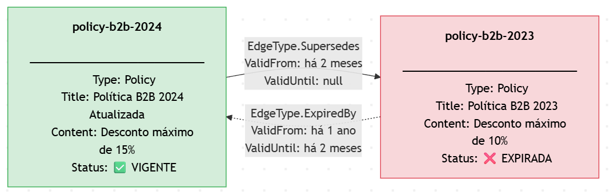
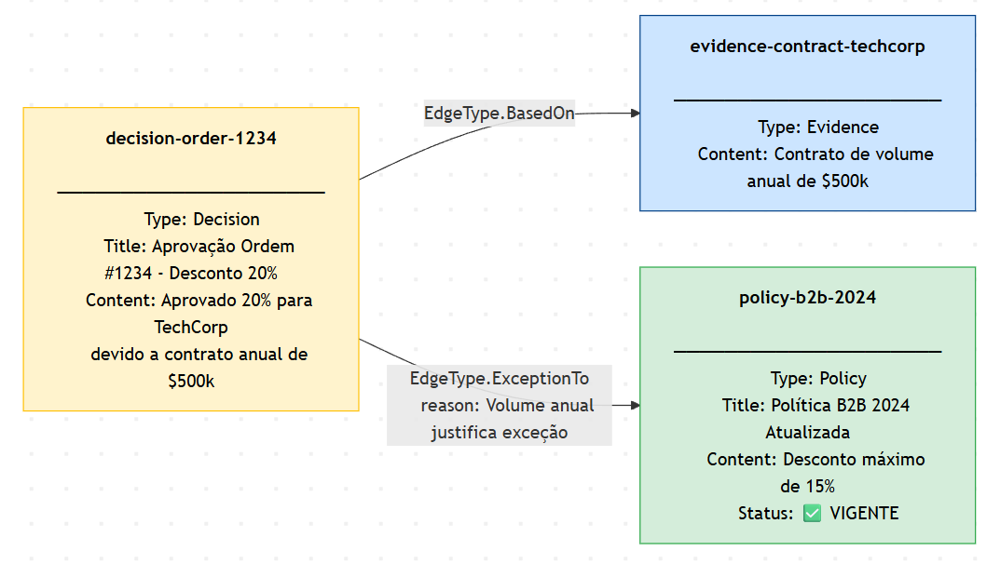
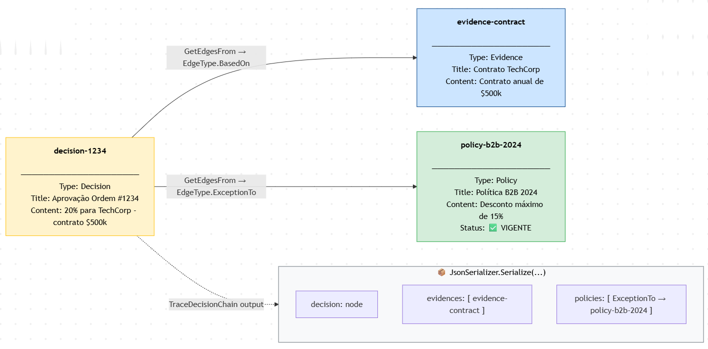
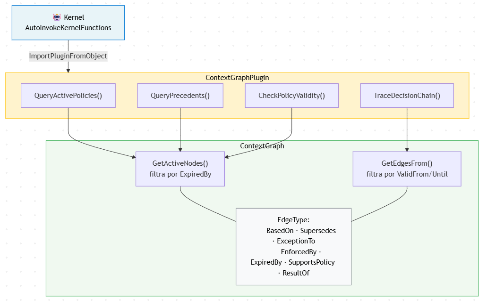
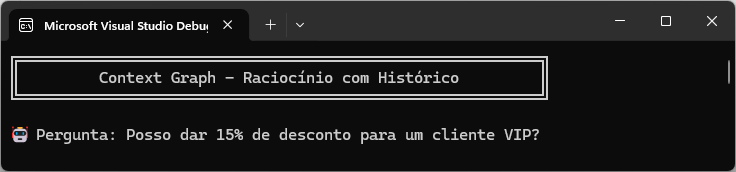
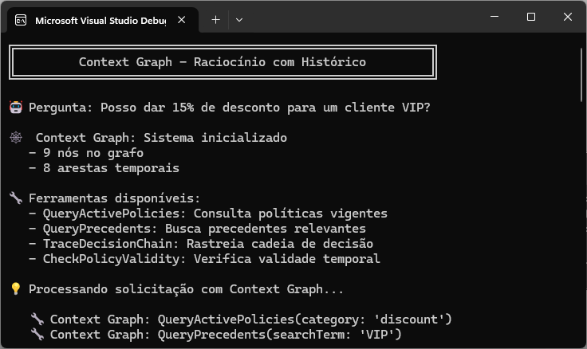
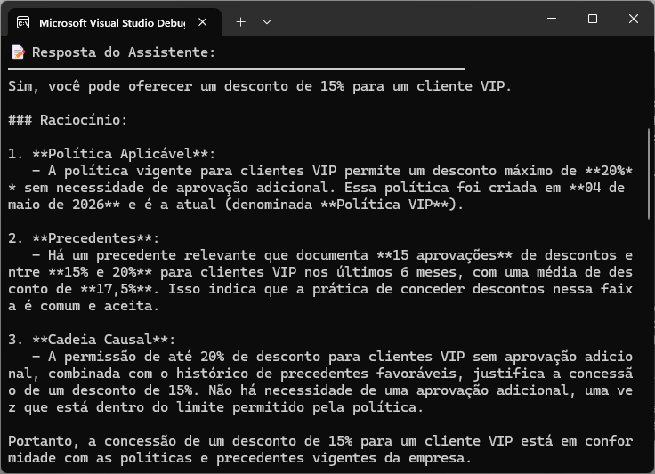
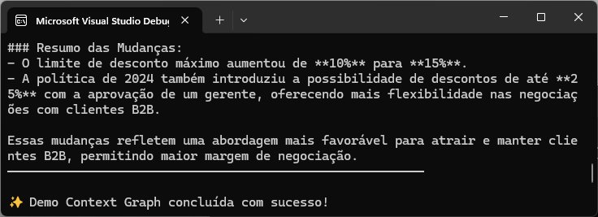

# .NET Semantic Kernel com Context Graph - Hands On


_Cover image: courtesy of Unsplash_

Se você programa em .NET e está explorando o universo de agentes de IA, este artigo é essencial para entender como dar memória institucional aos seus sistemas inteligentes.

Continuando esta série sobre **Semantic Kernel** e técnicas avançadas de IA, hoje vamos mergulhar em um conceito poderoso que vem ganhando destaque: **Context Graph (Grafo de Contexto)**.

Enquanto sistemas tradicionais apenas registram **O QUE** aconteceu, um Context Graph captura **O PORQUÊ** - transformando decisões, políticas e raciocínio institucional em estrutura consultável e legível por máquina.

## Contexto

Agentes de IA modernos precisam tomar decisões consistentes baseadas em políticas empresariais, precedentes históricos e evidências documentadas. Mas como garantir que um agente saiba **por que** uma decisão foi tomada no passado? Como evitar que ele aplique uma política que já foi superada?

O **Context Graph** é uma técnica de representação de conhecimento onde:

- **Decisões**, **políticas**, **exceções**, **precedentes** e **evidências** são modelados como **nós de primeira classe** em um grafo
- Cada aresta (edge) possui **validade temporal** (`ValidFrom` e `ValidUntil`)
- Fatos superados são **invalidados**, não sobrescritos
- Cadeias causais multi-hop podem ser rastreadas para entender a procedência

Para demonstrar isso em C#, vou criar um sistema de aprovação de descontos corporativos usando [**Microsoft Semantic Kernel**](https://learn.microsoft.com/en-us/semantic-kernel/overview/).

## Problema

Imagine um agente de IA que precisa aprovar solicitações de desconto para clientes. Sem um Context Graph, o agente enfrenta problemas graves:

### ❌ **Problema 1: Políticas Obsoletas**
```
🤖 Agente: "A política permite 10% de desconto para B2B"
👨‍💼 Gerente: "Mas mudamos isso há 2 meses! Agora é 15%!"
```

O agente não sabe que a política foi atualizada. Ele pode encontrar ambas as versões em documentos e não consegue determinar qual está vigente.

### ❌ **Problema 2: Exceções vs. Políticas**
```
🤖 Agente: "Vi que aprovamos 20% para TechCorp. Logo, posso aprovar 
           20% para qualquer cliente B2B."
👨‍💼 Gerente: "NÃO! Aquela foi uma EXCEÇÃO pontual devido a um 
           contrato de $500k. Não é política permanente!"
```

Sem contexto sobre **procedência**, o agente não consegue distinguir entre uma política estabelecida e uma exceção pontual.

### ❌ **Problema 3: Raciocínio Sem Evidências**
```
🤖 Agente: "Aprovei 25% de desconto."
👨‍💼 Gerente: "Com base em quê?"
🤖 Agente: "... Não sei, parecia razoável... foi mal, chefe!"
```

O agente não mantém rastro das **evidências** que justificam decisões, tornando impossível auditar ou explicar o raciocínio.


## Solução

Com um **Context Graph**, modelamos o conhecimento institucional como um grafo temporal onde cada decisão, política e evidência é rastreável:

### ✅ **Solução 1: Validade Temporal**

O método `AddNode` da biblioteca `ContextGraph` permite adicionar "nós de conhecimento", enquanto `AddEdge` conecta esses nós com arestas (edges) que possuem validade temporal.

```csharp
// Política antiga (EXPIRADA)
var oldB2BPolicy = graph.AddNode(new ContextNode
{
    Id = "policy-b2b-2023",
    Type = NodeType.Policy,
    Title = "Política B2B 2023",
    Content = "Desconto máximo de 10% para clientes B2B",
    Metadata = new Dictionary<string, object>
    {
        ["maxDiscount"] = 10
    }
});

// Política atual (VIGENTE)
var currentB2BPolicy = graph.AddNode(new ContextNode
{
    Id = "policy-b2b-2024",
    Type = NodeType.Policy,
    Title = "Política B2B 2024 (Atualizada)",
    Content = "Desconto máximo de 15% para clientes B2B",
    Metadata = new Dictionary<string, object>
    {
        ["maxDiscount"] = 15
    }
});

// Aresta temporal: nova política SUBSTITUI antiga
graph.AddEdge(new ContextEdge
{
    SourceId = currentB2BPolicy.Id,
    TargetId = oldB2BPolicy.Id,
    Type = EdgeType.Supersedes,
    ValidFrom = DateTime.UtcNow.AddMonths(-2), // Há 2 meses
    ValidUntil = null // Ainda válida
});

// Aresta temporal: antiga política EXPIROU
graph.AddEdge(new ContextEdge
{
    SourceId = oldB2BPolicy.Id,
    Type = EdgeType.ExpiredBy,
    ValidFrom = DateTime.UtcNow.AddYears(-1),
    ValidUntil = DateTime.UtcNow.AddMonths(-2) // Expirou há 2 meses
});
```

Note que, acima, estamos construindo nós do tipo `Policy`, com suas respectivas validades. Isso significa que, quando uma política é atualizada, a nova versão pode ser conectada à antiga com uma aresta do tipo `Supersedes`, e a antiga pode ser marcada como expirada com uma aresta do tipo `ExpiredBy`.



Resumindo: a nova política substitui a antiga, e a antiga é marcada como expirada.

✨ **Resultado**: O agente consulta apenas políticas **vigentes** e sabe exatamente quando cada política estava válida.

### ✅ **Solução 2: Exceções Documentadas**

Além de políticas, podemos modelar decisões excepcionais e as evidências que as justificam.

No trecho abaixo, estamos montando um cenário onde uma decisão de desconto de 20% para um cliente B2B (TechCorp) foi tomada como uma **exceção pontual** devido a um contrato anual de $500k.

```csharp
// Decisão excepcional
var exceptionDecision = graph.AddNode(new ContextNode
{
    Id = "decision-order-1234",
    Type = NodeType.Decision,
    Title = "Aprovação Ordem #1234 - Desconto 20%",
    Content = "Aprovado 20% para TechCorp devido a contrato anual de $500k"
});

// Evidência que justifica a exceção
var evidence = graph.AddNode(new ContextNode
{
    Id = "evidence-contract-techcorp",
    Type = NodeType.Evidence,
    Content = "Contrato de volume anual de $500k"
});

// Conectar: Decisão BASEADA EM evidência
graph.AddEdge(new ContextEdge
{
    SourceId = exceptionDecision.Id,
    TargetId = evidence.Id,
    Type = EdgeType.BasedOn
});

// Conectar: Decisão é EXCEÇÃO À política
graph.AddEdge(new ContextEdge
{
    SourceId = exceptionDecision.Id,
    TargetId = currentB2BPolicy.Id,
    Type = EdgeType.ExceptionTo,
    Metadata = new Dictionary<string, object>
    {
        ["reason"] = "Volume anual justifica exceção"
    }
});
```

Note que essa decisão é conectada à evidência que justifica a exceção, e também é marcada como uma exceção à política vigente, como ilustra o diagrama seguinte:



✨ **Resultado**: O agente sabe que aquela aprovação foi uma **exceção pontual**, não uma política permanente, e entende o **porquê**.

### ✅ **Solução 3: Cadeias Causais Rastreáveis**

Nos últimos blocos de código, vimos que decisões, políticas e evidências são modelados como nós conectados por arestas que indicam relações causais. Isso permite que o agente rastreie toda a cadeia de raciocínio por trás de uma decisão.

Já no trecho seguinte, podemos ver como o agente pode consultar o grafo para entender exatamente por que uma decisão foi tomada, rastreando as evidências e políticas relacionadas.

O método `GetEdgesFrom` da biblioteca `ContextGraph` permite recuperar as conexões de um nó específico, e a função `TraceDecisionChain` pode ser exposta como uma ferramenta para o agente consultar essa cadeia causal.

```csharp
// Ferramentas que o agente pode usar
[KernelFunction]
public string TraceDecisionChain(string nodeId)
{
    var node = _graph.GetNode(nodeId);

    // Rastrear evidências que embasaram a decisão
    var evidences = _graph.GetEdgesFrom(nodeId)
        .Where(e => e.Type == EdgeType.BasedOn)
        .Select(e => _graph.GetNode(e.TargetId));

    // Rastrear políticas relacionadas
    var policies = _graph.GetEdgesFrom(nodeId)
        .Where(e => e.Type == EdgeType.ExceptionTo || 
                    e.Type == EdgeType.EnforcedBy);

    // Retornar cadeia completa de raciocínio
    return JsonSerializer.Serialize(new
    {
        decision = node,
        evidences,
        policies
    });
}
```

Isso nos ajuda a entender que, por exemplo, a aprovação de 20% para TechCorp foi baseada em um contrato específico, e que essa decisão é uma exceção à política vigente de 15% para clientes B2B.



✨ **Resultado**: O agente pode explicar **exatamente** por que uma decisão foi tomada, rastreando toda a cadeia causal.

## Teoria

O **Kernel** do Semantic Kernel registra o `ContextGraphPlugin` via `ImportPluginFromObject`, expondo suas 4 funções (`QueryActivePolicies`, `QueryPrecedents`, `TraceDecisionChain`, `CheckPolicyValidity`) como ferramentas invocáveis automaticamente pelo agente (`AutoInvokeKernelFunctions`).



Cada uma dessas funções delega ao ContextGraph a consulta dos dados: três delas (`QueryActivePolicies`, `QueryPrecedents`, `CheckPolicyValidity`) chamam `GetActiveNodes()`, que filtra os nós excluindo os marcados com `EdgeType.ExpiredBy` cujo `ValidUntil` já passou.

Enquanto `TraceDecisionChain` chama `GetEdgesFrom()`, que navega pelas arestas ativas no tempo (`ValidFrom`/`ValidUntil`).

Toda a semântica das relações entre nós é governada pelo enum `EdgeType`, que define os 7 tipos de aresta possíveis — sendo `ExpiredBy` o tipo central para o controle de validade temporal do grafo.

## Executando o programa

Ao executar a aplicação abaixo, você verá como o Context Graph processa uma solicitação de desconto para um cliente VIP, considerando políticas vigentes, precedentes relevantes e a cadeia causal de decisões.



O sistema é inicializado, com 9 nós no grafo, e 8 arestas temporais, o que significa que temos um histórico rico de decisões, políticas e evidências para consultar.

As ferramentas disponíveis abaixo permitem que o agente consulte políticas vigentes, busque precedentes, rastreie cadeias de decisão e verifique a validade temporal de políticas.

Quando a aplicação processa a solicitação com Context Graph, o agente automaticamente invoca as ferramentas para consultar as políticas vigentes e buscar precedentes relevantes para clientes VIP.



Em seguida, vem a resposta do assitente, que justifica a concessão do desconto de 15% para o cliente VIP, citando a política vigente, os precedentes relevantes e a cadeia causal que embasa a decisão.



E na demonstração da consulta com evolução temporal, fica evidente que a política de descontos para clientes B2B mudou ao longo do tempo, e o agente é capaz de identificar qual política estava vigente em um determinado momento, além de entender a evolução das diretrizes de descontos para clientes B2B.

E para finalizar, vemos abaixo que a política de descontos para clientes B2B evoluiu de uma diretriz mais rígida (10% sem aprovação) para uma diretriz mais flexível (15% sem aprovação e 25% com aprovação), demonstrando a capacidade do Context Graph de capturar a evolução temporal das políticas e fornecer insights sobre as mudanças nas diretrizes de descontos ao longo do tempo.



## Conclusão

A adoção de **Context Graph** representa um salto qualitativo na construção de agentes de IA empresariais. Enquanto sistemas de registro tradicionais capturam apenas **o que aconteceu**, um grafo de contexto preserva **o porquê**, transformando conhecimento institucional tácito em estrutura consultável.

**Vantagens consolidadas:**

- ✅ **Rastreabilidade**: Cada decisão possui cadeia causal completa
- ✅ **Temporalidade**: Políticas obsoletas são invalidadas, não sobrescritas
- ✅ **Transparência**: Agentes podem explicar seu raciocínio
- ✅ **Consistência**: Exceções não são confundidas com políticas
- ✅ **Auditabilidade**: Todo o histórico de evolução é preservado

Essa técnica é especialmente vital para **aplicações baseadas em agentes** que exigem:
- Memória persistente entre sessões
- Raciocínio de decisão rastreável
- Aplicação consistente de políticas corporativas
- Distinção clara entre normas e exceções

## Código Completo

```csharp
// ============================================================
//  Program08 — Context Graph (Grafo de Contexto)
// ============================================================

using Microsoft.SemanticKernel;
using Microsoft.SemanticKernel.ChatCompletion;
using Microsoft.SemanticKernel.Connectors.OpenAI;
using System.ComponentModel;
using System.Text.Json;

Console.OutputEncoding = System.Text.Encoding.UTF8;

// ── Main Program ──────────────────────────────────────────
var endpoint = "https://models.github.ai/inference";
var credential = Environment.GetEnvironmentVariable("GITHUB_TOKEN");
var model = "openai/gpt-4o-mini";

if (string.IsNullOrWhiteSpace(credential))
{
    Console.Error.WriteLine("Erro: variável GITHUB_TOKEN não configurada.");
    Environment.Exit(1);
}

var httpClient = new HttpClient();
httpClient.BaseAddress = new Uri(endpoint);

var kernel = Kernel.CreateBuilder()
    .AddOpenAIChatCompletion(
        modelId: model,
        apiKey: credential,
        httpClient: httpClient)
    .Build();

// Inicializar e popular o grafo
var contextGraph = new ContextGraph();
SeedContextGraph(contextGraph);

// Registrar plugin
kernel.ImportPluginFromObject(
    new ContextGraphPlugin(contextGraph), 
    "ContextGraph"
);

string userQuery = args.Length > 1
    ? string.Join(" ", args.Skip(1))
    : "Posso dar 15% de desconto para um cliente VIP?";

Console.WriteLine("╔══════════════════════════════════════════════════════════╗");
Console.WriteLine("║         Context Graph - Raciocínio com Histórico         ║");
Console.WriteLine("╚══════════════════════════════════════════════════════════╝");
Console.WriteLine();
Console.WriteLine($"🤖 Pergunta: {userQuery}");
Console.WriteLine();

var executionSettings = new OpenAIPromptExecutionSettings
{
    ToolCallBehavior = ToolCallBehavior.AutoInvokeKernelFunctions,
    Temperature = 0.7,
    MaxTokens = 1500
};

Console.WriteLine("🕸️  Context Graph: Sistema inicializado");
Console.WriteLine($"   - {contextGraph.GetAllNodes().Count()} nós no grafo");
Console.WriteLine($"   - {contextGraph.GetAllEdges().Count()} arestas temporais");
Console.WriteLine();

var chatHistory = new ChatHistory();
chatHistory.AddSystemMessage(
    "Você é um assistente de aprovação de descontos que tem acesso a um Context Graph " +
    "com histórico completo de decisões, políticas e precedentes da empresa. " +
    "\n\nSempre que analisar uma solicitação de desconto:" +
    "\n1. Consulte as políticas VIGENTES (não use políticas expiradas)" +
    "\n2. Busque precedentes relevantes para o caso" +
    "\n3. Rastreie as cadeias de decisão quando necessário" +
    "\n4. Explique CLARAMENTE o raciocínio, citando:" +
    "\n   - Qual política se aplica e desde quando está vigente" +
    "\n   - Se há precedentes e se foram exceções ou política permanente" +
    "\n   - A cadeia causal que justifica a decisão"
);
chatHistory.AddUserMessage(userQuery);

var chat = kernel.GetRequiredService<IChatCompletionService>();
var response = await chat.GetChatMessageContentAsync(
    chatHistory,
    executionSettings: executionSettings,
    kernel: kernel
);

Console.WriteLine("📝 Resposta do Assistente:");
Console.WriteLine("─────────────────────────────────────────────────────────");
Console.WriteLine(response.Content);
Console.WriteLine("─────────────────────────────────────────────────────────");

// ══════════════════════════════════════════════════════════
//  Context Graph - Classes de Domínio
// ══════════════════════════════════════════════════════════

enum NodeType
{
    Policy,
    Decision,
    Precedent,
    Evidence,
    Exception
}

enum EdgeType
{
    BasedOn,
    Supersedes,
    ExceptionTo,
    EnforcedBy,
    ExpiredBy,
    SupportsPolicy,
    ResultOf
}

class ContextNode
{
    public string Id { get; set; } = string.Empty;
    public NodeType Type { get; set; }
    public string Title { get; set; } = string.Empty;
    public string Content { get; set; } = string.Empty;
    public DateTime CreatedAt { get; set; } = DateTime.UtcNow;
    public Dictionary<string, object> Metadata { get; set; } = new();
}

class ContextEdge
{
    public string Id { get; set; } = string.Empty;
    public string SourceId { get; set; } = string.Empty;
    public string TargetId { get; set; } = string.Empty;
    public EdgeType Type { get; set; }
    public DateTime ValidFrom { get; set; }
    public DateTime? ValidUntil { get; set; }
    public Dictionary<string, object> Metadata { get; set; } = new();
}

class ContextGraph
{
    private readonly Dictionary<string, ContextNode> _nodes = new();
    private readonly List<ContextEdge> _edges = new();

    public ContextNode AddNode(ContextNode node)
    {
        _nodes[node.Id] = node;
        return node;
    }

    public ContextEdge AddEdge(ContextEdge edge)
    {
        _edges.Add(edge);
        return edge;
    }

    public ContextNode? GetNode(string id) => _nodes.GetValueOrDefault(id);
    public IEnumerable<ContextNode> GetAllNodes() => _nodes.Values;
    public IEnumerable<ContextEdge> GetAllEdges() => _edges;

    public IEnumerable<ContextEdge> GetEdgesFrom(string nodeId, DateTime? asOf = null)
    {
        var timestamp = asOf ?? DateTime.UtcNow;
        return _edges.Where(e =>
            e.SourceId == nodeId &&
            e.ValidFrom <= timestamp &&
            (e.ValidUntil == null || e.ValidUntil > timestamp)
        );
    }

    public IEnumerable<ContextNode> GetActiveNodes(NodeType type, DateTime? asOf = null)
    {
        var timestamp = asOf ?? DateTime.UtcNow;
        var expiredNodeIds = _edges
            .Where(e => e.Type == EdgeType.ExpiredBy && e.ValidUntil <= timestamp)
            .Select(e => e.SourceId)
            .ToHashSet();

        return _nodes.Values
            .Where(n => n.Type == type && !expiredNodeIds.Contains(n.Id));
    }

    public IEnumerable<ContextNode> TraceChain(string startNodeId, EdgeType edgeType, int maxDepth = 5)
    {
        var visited = new HashSet<string>();
        var result = new List<ContextNode>();
        var queue = new Queue<(string nodeId, int depth)>();
        queue.Enqueue((startNodeId, 0));

        while (queue.Count > 0)
        {
            var (currentId, depth) = queue.Dequeue();
            if (depth >= maxDepth || visited.Contains(currentId))
                continue;

            visited.Add(currentId);
            var node = GetNode(currentId);
            if (node != null)
                result.Add(node);

            var edges = GetEdgesFrom(currentId).Where(e => e.Type == edgeType);
            foreach (var edge in edges)
                queue.Enqueue((edge.TargetId, depth + 1));
        }

        return result;
    }
}

// ══════════════════════════════════════════════════════════
//  Context Graph Plugin
// ══════════════════════════════════════════════════════════

class ContextGraphPlugin
{
    private readonly ContextGraph _graph;

    public ContextGraphPlugin(ContextGraph graph)
    {
        _graph = graph;
    }

    [KernelFunction, Description("Consulta políticas VIGENTES")]
    public string QueryActivePolicies(
        [Description("Categoria (ex: 'discount')")] string category = "all")
    {
        var activePolicies = _graph.GetActiveNodes(NodeType.Policy);

        if (category != "all")
        {
            activePolicies = activePolicies.Where(p =>
                p.Metadata.TryGetValue("category", out var cat) &&
                cat.ToString()!.Equals(category, StringComparison.OrdinalIgnoreCase)
            );
        }

        var policies = activePolicies.Select(p => new
        {
            id = p.Id,
            title = p.Title,
            content = p.Content,
            metadata = p.Metadata
        }).ToList();

        return JsonSerializer.Serialize(new
        {
            category,
            count = policies.Count,
            policies
        }, new JsonSerializerOptions { WriteIndented = true });
    }

    [KernelFunction, Description("Busca precedentes históricos")]
    public string QueryPrecedents(
        [Description("Termo de busca")] string searchTerm)
    {
        var precedents = _graph.GetAllNodes()
            .Where(n => n.Type == NodeType.Precedent)
            .Where(n =>
                n.Title.Contains(searchTerm, StringComparison.OrdinalIgnoreCase) ||
                n.Content.Contains(searchTerm, StringComparison.OrdinalIgnoreCase)
            )
            .Select(p => new
            {
                id = p.Id,
                title = p.Title,
                content = p.Content,
                metadata = p.Metadata
            })
            .ToList();

        return JsonSerializer.Serialize(new
        {
            searchTerm,
            count = precedents.Count,
            precedents
        }, new JsonSerializerOptions { WriteIndented = true });
    }

    [KernelFunction, Description("Rastreia cadeia de decisão")]
    public string TraceDecisionChain(
        [Description("ID do nó")] string nodeId)
    {
        var node = _graph.GetNode(nodeId);
        if (node == null)
        {
            return JsonSerializer.Serialize(new
            {
                error = $"Nó '{nodeId}' não encontrado"
            });
        }

        var evidences = _graph.GetEdgesFrom(nodeId)
            .Where(e => e.Type == EdgeType.BasedOn)
            .Select(e => _graph.GetNode(e.TargetId))
            .Where(n => n != null)
            .Select(n => new { n!.Title, n.Content })
            .ToList();

        return JsonSerializer.Serialize(new
        {
            node = new { node.Title, node.Content },
            evidences
        }, new JsonSerializerOptions { WriteIndented = true });
    }

    [KernelFunction, Description("Verifica validade de políticas")]
    public string CheckPolicyValidity(
        [Description("Segmento (ex: 'B2B')")] string segment,
        [Description("Data YYYY-MM-DD ou 'now'")] string dateString = "now")
    {
        DateTime checkDate = dateString == "now" 
            ? DateTime.UtcNow 
            : DateTime.Parse(dateString);

        var policies = _graph.GetAllNodes()
            .Where(n => n.Type == NodeType.Policy)
            .Where(n => n.Metadata.TryGetValue("segment", out var seg) &&
                       seg.ToString()!.Equals(segment, StringComparison.OrdinalIgnoreCase))
            .Select(p => new
            {
                p.Title,
                p.Content,
                p.CreatedAt
            })
            .ToList();

        return JsonSerializer.Serialize(new
        {
            segment,
            checkDate,
            policies
        }, new JsonSerializerOptions { WriteIndented = true });
    }
}

// ══════════════════════════════════════════════════════════
//  Seed Data
// ══════════════════════════════════════════════════════════

static void SeedContextGraph(ContextGraph graph)
{
    var now = DateTime.UtcNow;

    // Política antiga (expirada)
    var oldPolicy = graph.AddNode(new ContextNode
    {
        Id = "policy-b2b-2023",
        Type = NodeType.Policy,
        Title = "Política B2B 2023",
        Content = "Desconto máximo de 10% sem aprovação",
        Metadata = new Dictionary<string, object>
        {
            ["category"] = "discount",
            ["segment"] = "B2B",
            ["maxDiscount"] = 10
        }
    });

    // Política atual (vigente)
    var currentPolicy = graph.AddNode(new ContextNode
    {
        Id = "policy-b2b-2024",
        Type = NodeType.Policy,
        Title = "Política B2B 2024",
        Content = "Desconto máximo de 15% sem aprovação",
        Metadata = new Dictionary<string, object>
        {
            ["category"] = "discount",
            ["segment"] = "B2B",
            ["maxDiscount"] = 15
        }
    });

    // Política VIP
    var vipPolicy = graph.AddNode(new ContextNode
    {
        Id = "policy-vip-current",
        Type = NodeType.Policy,
        Title = "Política VIP",
        Content = "Desconto até 20% sem aprovação",
        Metadata = new Dictionary<string, object>
        {
            ["category"] = "discount",
            ["segment"] = "VIP",
            ["maxDiscount"] = 20
        }
    });

    // Conectar evolução temporal
    graph.AddEdge(new ContextEdge
    {
        Id = "edge-supersedes",
        SourceId = currentPolicy.Id,
        TargetId = oldPolicy.Id,
        Type = EdgeType.Supersedes,
        ValidFrom = now.AddMonths(-2),
        ValidUntil = null
    });

    graph.AddEdge(new ContextEdge
    {
        Id = "edge-expired",
        SourceId = oldPolicy.Id,
        TargetId = currentPolicy.Id,
        Type = EdgeType.ExpiredBy,
        ValidFrom = now.AddYears(-1),
        ValidUntil = now.AddMonths(-2)
    });

    // Decisão excepcional com evidência
    var decision = graph.AddNode(new ContextNode
    {
        Id = "decision-1234",
        Type = NodeType.Decision,
        Title = "Aprovação Ordem #1234",
        Content = "20% para TechCorp - contrato $500k",
        Metadata = new Dictionary<string, object>
        {
            ["discount"] = 20,
            ["customer"] = "TechCorp"
        }
    });

    var evidence = graph.AddNode(new ContextNode
    {
        Id = "evidence-contract",
        Type = NodeType.Evidence,
        Title = "Contrato TechCorp",
        Content = "Contrato anual de $500k"
    });

    graph.AddEdge(new ContextEdge
    {
        SourceId = decision.Id,
        TargetId = evidence.Id,
        Type = EdgeType.BasedOn,
        ValidFrom = now.AddDays(-30),
        ValidUntil = null
    });

    graph.AddEdge(new ContextEdge
    {
        SourceId = decision.Id,
        TargetId = currentPolicy.Id,
        Type = EdgeType.ExceptionTo,
        ValidFrom = now.AddDays(-30),
        ValidUntil = null,
        Metadata = new Dictionary<string, object>
        {
            ["reason"] = "Volume anual justifica exceção"
        }
    });

    // Precedente VIP
    var precedent = graph.AddNode(new ContextNode
    {
        Id = "precedent-vip",
        Type = NodeType.Precedent,
        Title = "Precedente VIP 15-20%",
        Content = "15 aprovações consistentes em 6 meses",
        Metadata = new Dictionary<string, object>
        {
            ["count"] = 15,
            ["avgDiscount"] = 17.5
        }
    });

    graph.AddEdge(new ContextEdge
    {
        SourceId = precedent.Id,
        TargetId = vipPolicy.Id,
        Type = EdgeType.SupportsPolicy,
        ValidFrom = now.AddMonths(-6),
        ValidUntil = null
    });
}
```

---

**Fontes:**

- [Technology Radar ThoughtWorks | Volume 34](https://www.thoughtworks.com/pt-br/radar)

- [Microsoft Semantic Kernel Documentation](https://learn.microsoft.com/en-us/semantic-kernel/overview/)

- [Context Graph - AI Engineering Patterns](https://trustgraph.ai/guides/key-concepts/context-graphs/)

---

**Como executar o código?**

Antes de executar o código pelo Visual Studio, você deve configurar a variável de ambiente `GITHUB_TOKEN` com um token de acesso pessoal do GitHub que tenha permissão para acessar os modelos de IA hospedados no GitHub. Você pode criar um token seguindo as instruções na [documentação do GitHub](https://docs.github.com/en/authentication/keeping-your-account-and-data-secure/creating-a-personal-access-token).

```bash
# Configurar token
$env:GITHUB_TOKEN = "seu-token-aqui"
```
