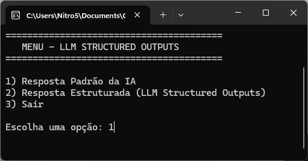
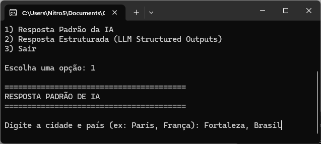
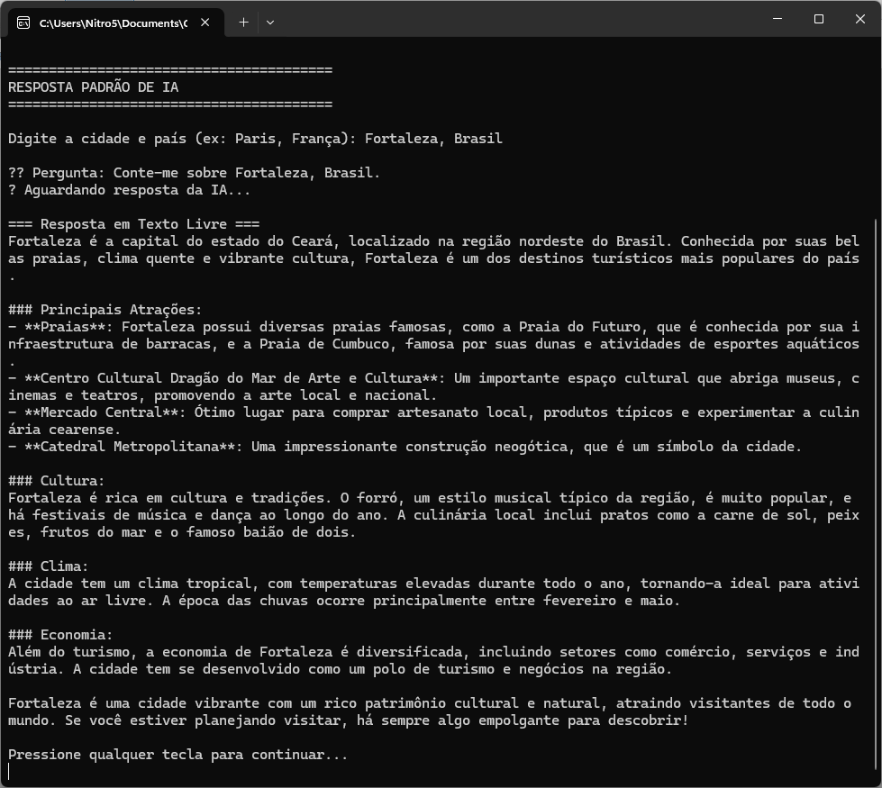
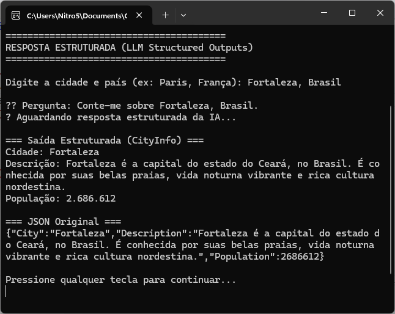

# .NET Semantic Kernel + Structured Output From LLMs


Se você programa em .NET e gosta de ficar atualizado sobre IA, não pode deixar este artigo passar despercebido.

Esses dias eu estava passeando pelo último [**Technology Radar da ThoughtWorks (abril 2026)**](https://www.thoughtworks.com/pt-br/radar), e, como eu já esperava, notei várias tecnologias, técnicas, ferramentas, etc. relacionadas a **Inteligência Artificial**.

Um dos tópicos do **Radar** me chamou a atenção. **Saídas estruturadas de LLMs (Structured output from LLMs)**. Daí pensei: como aplicar esse conceito à linguagem C#?

## Contexto

Os LLMs (Large Language Models) são muito bons em gerar conteúdo, mesmo a partir de instruções simples.

Para demonstrar isso em C#, podemos usar o [**Microsoft Semantic Kernel**](https://learn.microsoft.com/en-us/semantic-kernel/overview/), que é uma biblioteca que facilita a integração de LLMs em aplicações .NET.

Abaixo, o menu inicial da aplicação de exemplo deste artigo, onde o usuário pode escolher entre obter uma resposta padrão (texto livre) ou uma resposta estruturada (JSON):



Ao escolher a opção 1, o usuário é instruído a fornecer o nome de uma cidade e país: **Fortaleza, Brasil**



## O Problema

Veja que, ao prosseguir, o modelo retorna um texto bastante verboso, quase como uma página de enciclopédia:




O problema é que, embora a resposta sobre a cidade de Fortaleza seja muito rica e envolvente, ela não é fácil de ser processada por um sistema. Se quisermos extrair informações específicas, como o nome da cidade, a descrição e a população, teríamos que usar técnicas de NLP (Natural Language Processing) para analisar o texto e extrair esses dados.

Nesse caso, o risco de erros é alto, pois o modelo pode formatar a resposta de maneiras diferentes, usar sinônimos, ou até mesmo cometer erros de formatação.

Pense no que isso poderia causar a um sistema rodando em backend, que precisa de dados precisos e estruturados para funcionar corretamente. Se o modelo retornar uma resposta inesperada, isso pode quebrar o sistema ou levar a resultados incorretos. E a detecção da causa-raiz e correção de erros pode levar muito tempo e esforço.

## A Solução: LLM Structured Outputs

Ok, então você já sabe o que não quer: respostas em texto livre que são difíceis de processar. Mas o que você quer realmente? Olhando para os requisitos do seu sistema, você descobre que só precisa de 3 informações sobre a cidade: 

- o nome da cidade
- uma breve descrição da cidade
- a população da cidade

E você quer essas informações em um formato que seja fácil de integrar, como JSON.


Após refatorar o código para usar a técnica de **LLM Structured Outputs**, o modelo é instruído a retornar uma resposta seguindo um formato específico (JSON), que pode ser facilmente integrado em sistemas maiores.

Agora, na opção 2, o modelo é instruído a retornar uma resposta estruturada, seguindo um formato específico (JSON), que pode ser facilmente integrado em sistemas maiores.



Existem várias vantagens nessa abordagem:
- **Custo**: Ao obter apenas as informações necessárias, você pode reduzir o número de tokens usados na resposta, o que pode levar a custos mais baixos ao usar APIs de LLMs.
- **Precisão**: O modelo é instruído a seguir um formato específico, o que reduz a chance de erros de formatação ou variações inesperadas na resposta.
- **Facilidade de Integração**: A resposta em JSON pode ser facilmente desserializada em objetos C# ou outras estruturas de dados, facilitando a integração com sistemas maiores.
- **Manutenção**: Se o modelo retornar uma resposta inesperada, é mais fácil identificar o problema, pois a estrutura do JSON é clara e consistente.  

## Teoria

Primeiro definimos um record C# chamado `CityInfo`, que representa o esquema da resposta que queremos obter do modelo. Cada propriedade do record tem um atributo `Description` que fornece uma descrição clara do que cada campo representa.

```csharp
	public record CityInfo(
		[property: Description("O nome da cidade")]
		string City,

		[property: Description("Uma breve descrição da cidade")]
		string Description,

		[property: Description("A população estimada da cidade")]
		int Population
	);
```

Então, antes de montarmos o prompt e enviarmos para o Semantic Kernel, criamos uma nova instância de `CityInfo` com valores de exemplo:

```csharp
			// Crie o prompt solicitando resposta estruturada
			var chatHistory = new ChatHistory();

			var schemaExample = new CityInfo(
				City: "string",
				Description: "string",
				Population: 0
			);
```      

Então finalmente montamos nosso prompt com instruções claras para o modelo, incluindo o esquema de resposta que queremos:

```csharp
			chatHistory.AddSystemMessage(
				$"Você é um assistente que retorna informações sobre cidades APENAS em formato JSON válido. " +
				$"O JSON deve seguir exatamente este schema: {JsonSerializer.Serialize(schemaExample)}"
			);
			chatHistory.AddUserMessage(pergunta);

			// Obtenha a resposta
			var result = await chatService.GetChatMessageContentAsync(
				chatHistory,
				executionSettings
			);
```

> [!NOTE]
> Note como nosso prompt já adere dinamicamente ao formato definido pelo record `CityInfo`. Isso significa que, se quisermos alterar o formato da resposta no futuro, basta atualizar o record `CityInfo` e a instrução no prompt será atualizada automaticamente, garantindo que o modelo siga o novo formato!

## Solução Completa:

```csharp
using Microsoft.SemanticKernel;
using Microsoft.SemanticKernel.ChatCompletion;
using Microsoft.SemanticKernel.Connectors.OpenAI;
using System.ComponentModel;
using System.Text.Json;

#pragma warning disable SKEXP0010

namespace LlmStructuredOutputs
{
	// 1. Defina o esquema da resposta como um record C# com atributos descritivos
	public record CityInfo(
		[property: Description("O nome da cidade")]
		string City,

		[property: Description("Uma breve descrição da cidade")]
		string Description,

		[property: Description("A população estimada da cidade")]
		int Population
	);

	public class Program
	{
		private static Kernel? _kernel;

		public static async Task Main(string[] args)
		{
			var endpoint = "https://models.github.ai/inference";
			var credential = Environment.GetEnvironmentVariable("GITHUB_TOKEN");
			var model = "gpt-4o-mini";

			if (string.IsNullOrEmpty(credential))
			{
				Console.WriteLine("GITHUB_TOKEN environment variable is not set.");
				return;
			}

			// Configure o Semantic Kernel
			var builder = Kernel.CreateBuilder();
			builder.AddOpenAIChatCompletion(
				modelId: model,
				apiKey: credential,
				endpoint: new Uri(endpoint)
			);
			_kernel = builder.Build();

			// Loop do menu principal
			while (true)
			{
				ExibirMenu();
				var opcao = Console.ReadLine();

				switch (opcao)
				{
					case "1":
						await ExecutarRespostaPadrao();
						break;
					case "2":
						await ExecutarRespostaEstruturada();
						break;
					case "3":
						Console.WriteLine("\nEncerrando aplicação...");
						return;
					default:
						Console.WriteLine("\n❌ Opção inválida! Tente novamente.\n");
						break;
				}

				Console.WriteLine("\nPressione qualquer tecla para continuar...");
				Console.ReadKey();
				Console.Clear();
			}
		}

		private static void ExibirMenu()
		{
			Console.WriteLine("========================================");
			Console.WriteLine("   MENU - LLM STRUCTURED OUTPUTS");
			Console.WriteLine("========================================");
			Console.WriteLine();
			Console.WriteLine("1) Resposta Padrão da IA");
			Console.WriteLine("2) Resposta Estruturada (LLM Structured Outputs)");
			Console.WriteLine("3) Sair");
			Console.WriteLine();
			Console.Write("Escolha uma opção: ");
		}

		private static async Task ExecutarRespostaPadrao()
		{
			Console.WriteLine("\n========================================");
			Console.WriteLine("RESPOSTA PADRÃO DE IA");
			Console.WriteLine("========================================\n");

			Console.Write("Digite a cidade e país (ex: Paris, França): ");
			var entrada = Console.ReadLine();

			if (string.IsNullOrWhiteSpace(entrada))
			{
				Console.WriteLine("❌ Entrada não pode ser vazia!");
				return;
			}

			var pergunta = $"Conte-me sobre {entrada}.";
			Console.WriteLine($"\n📝 Pergunta: {pergunta}");
			Console.WriteLine("⏳ Aguardando resposta da IA...\n");
			await ObterRespostaPadraoAsync(pergunta);
		}

		private static async Task ExecutarRespostaEstruturada()
		{
			Console.WriteLine("\n========================================");
			Console.WriteLine("RESPOSTA ESTRUTURADA (LLM Structured Outputs)");
			Console.WriteLine("========================================\n");

			Console.Write("Digite a cidade e país (ex: Paris, França): ");
			var entrada = Console.ReadLine();

			if (string.IsNullOrWhiteSpace(entrada))
			{
				Console.WriteLine("❌ Entrada não pode ser vazia!");
				return;
			}

			var pergunta = $"Conte-me sobre {entrada}.";
			Console.WriteLine($"\n📝 Pergunta: {pergunta}");
			Console.WriteLine("⏳ Aguardando resposta estruturada da IA...\n");
			await ObterRespostaEstruturadaAsync(pergunta);
		}

		/// <summary>
		/// Obtém uma resposta padrão (texto livre) da IA
		/// </summary>
		private static async Task ObterRespostaPadraoAsync(string pergunta)
		{
			if (_kernel == null) throw new InvalidOperationException("Kernel não inicializado.");

			var chatService = _kernel.GetRequiredService<IChatCompletionService>();

			// Prompt simples sem requisitos de estrutura
			var chatHistory = new ChatHistory();
			chatHistory.AddSystemMessage("Você é um assistente prestativo que fornece informações sobre cidades.");
			chatHistory.AddUserMessage(pergunta);

			// Sem configurações especiais - resposta em texto livre
			var result = await chatService.GetChatMessageContentAsync(chatHistory);

			Console.WriteLine("=== Resposta em Texto Livre ===");
			Console.WriteLine(result.Content);
		}

		/// <summary>
		/// Obtém uma resposta estruturada da IA seguindo o schema CityInfo
		/// Implementa a técnica "LLM Structured Outputs" do Radar da ThoughtWorks
		/// </summary>
		private static async Task<CityInfo?> ObterRespostaEstruturadaAsync(string pergunta)
		{
			if (_kernel == null) throw new InvalidOperationException("Kernel não inicializado.");

			var chatService = _kernel.GetRequiredService<IChatCompletionService>();

			// Configure as settings para forçar resposta em formato JSON
			var executionSettings = new OpenAIPromptExecutionSettings
			{
				ResponseFormat = "json_object"
			};

			// Crie o prompt solicitando resposta estruturada
			var chatHistory = new ChatHistory();

			// Gera um exemplo do schema usando o próprio CityInfo
			var schemaExample = new CityInfo(
				City: "string",
				Description: "string",
				Population: 0
			);

			chatHistory.AddSystemMessage(
				$"Você é um assistente que retorna informações sobre cidades APENAS em formato JSON válido. " +
				$"O JSON deve seguir exatamente este schema: {JsonSerializer.Serialize(schemaExample)}"
			);
			chatHistory.AddUserMessage(pergunta);

			// Obtenha a resposta
			var result = await chatService.GetChatMessageContentAsync(
				chatHistory,
				executionSettings
			);

			// O resultado vem como JSON e pode ser desserializado para CityInfo
			var content = result.Content ?? string.Empty;

			try
			{
				var cityInfo = JsonSerializer.Deserialize<CityInfo>(content, new JsonSerializerOptions
				{
					PropertyNameCaseInsensitive = true
				});

				Console.WriteLine("=== Saída Estruturada (CityInfo) ===");
				Console.WriteLine($"Cidade: {cityInfo?.City}");
				Console.WriteLine($"Descrição: {cityInfo?.Description}");
				Console.WriteLine($"População: {cityInfo?.Population:N0}");
				Console.WriteLine("\n=== JSON Original ===");
				Console.WriteLine(content);

				return cityInfo;
			}
			catch (JsonException ex)
			{
				Console.WriteLine($"Erro ao desserializar JSON: {ex.Message}");
				Console.WriteLine($"Conteúdo recebido: {content}");
				return null;
			}
		}
	}
}
```

---
Fontes:

:link:[Technology Radar ThoughtWorks | Volume 34 | Abril 2026](https://www.thoughtworks.com/pt-br/radar)
:link:[Microsoft Semantic Kernel Documentation](https://learn.microsoft.com/en-us/semantic-kernel/overview/)
